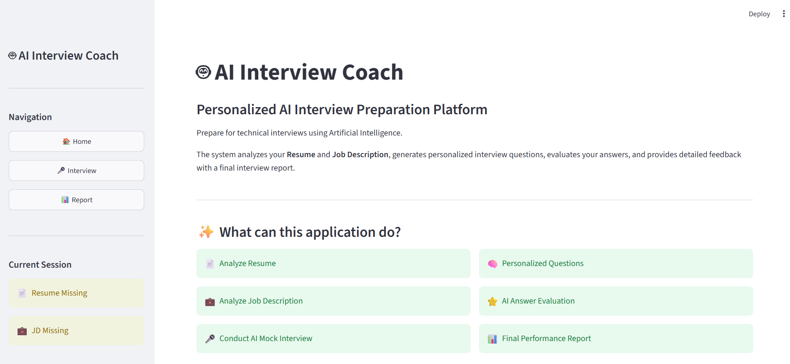
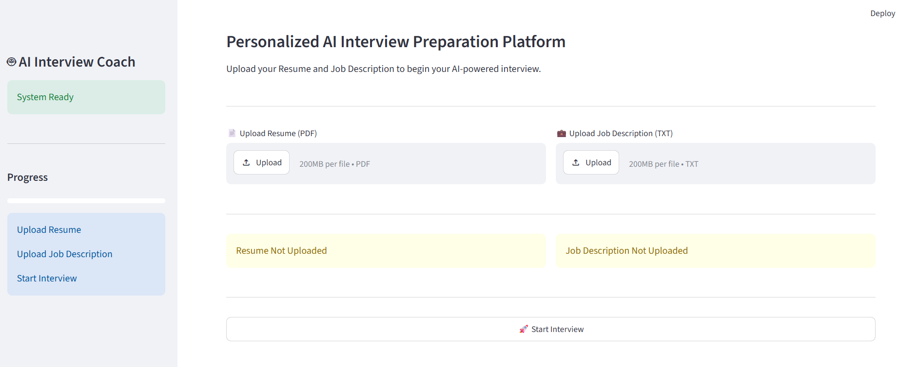
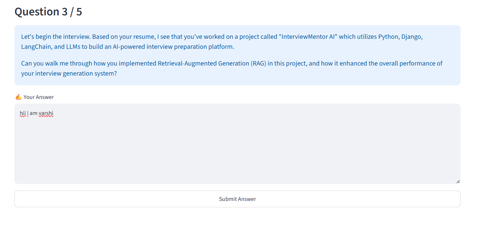
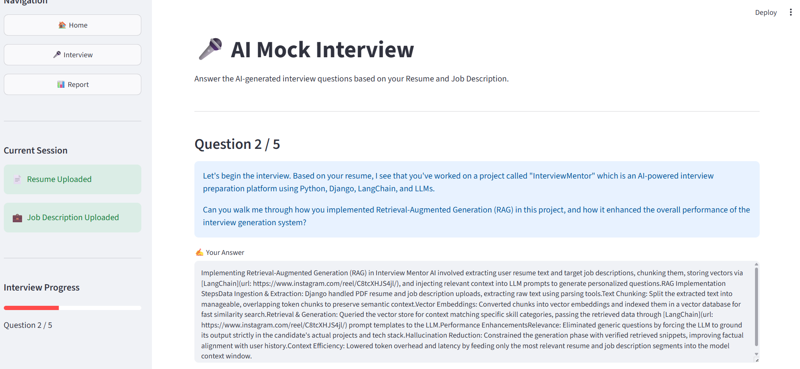
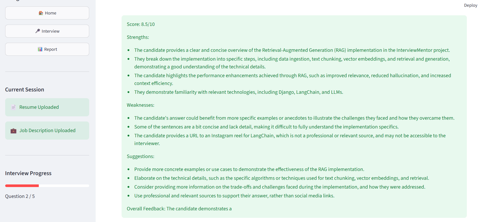
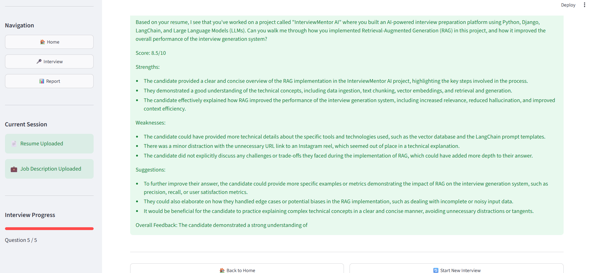

# 🎯 InterviewMentor AI

> An AI-powered interview preparation platform that generates personalized interview questions, evaluates candidate responses, and provides detailed feedback using Artificial Intelligence.


---

# 🚀 Live Demo

### 🌐 Streamlit Application

https://ai-placement-mentor-xbtbwsnaxhyrt7dnwap7t5.streamlit.app/

---

# 📖 About the Project

InterviewMentor AI is an intelligent interview preparation platform designed to simulate technical interviews using Artificial Intelligence.

The application analyzes a candidate's **Resume** and **Job Description**, generates personalized interview questions, evaluates each answer using a Large Language Model, and provides a comprehensive performance report with strengths, weaknesses, and improvement suggestions.

The project leverages **Retrieval-Augmented Generation (RAG)** to generate context-aware interview questions and feedback.

---

# ✨ Features

- 📄 Resume Analysis
- 💼 Job Description Analysis
- 🤖 AI-powered Mock Interviews
- 🧠 Personalized Interview Questions
- 📊 AI-based Answer Evaluation
- ⭐ Interview Score Generation
- 📈 Performance Report
- 💡 Improvement Suggestions
- 🚀 Interactive Streamlit Interface

---

# 🏗️ AI Workflow

```text
Resume + Job Description
            │
            ▼
     Text Extraction
            │
            ▼
        Text Chunking
            │
            ▼
 HuggingFace Embeddings
            │
            ▼
      FAISS Vector DB
            │
            ▼
    Relevant Context Retrieval
            │
            ▼
          Groq LLM
            │
            ▼
 Interview Questions & Evaluation
```

---

# 🛠️ Technologies Used

| Category | Technologies |
|----------|--------------|
| Language | Python |
| Frontend | Streamlit |
| AI Framework | LangChain |
| LLM | Groq |
| Embeddings | HuggingFace Sentence Transformers |
| Vector Database | FAISS |
| PDF Processing | PyPDF |
| ML Libraries | Transformers, Torch |

---

# 📂 Project Structure

```text
AI_INTERVIEW_COACH/
│
├── app.py
├── requirements.txt
├── README.md
├── src/
├── data/
├── screenshots/
│   ├── home.png
│   ├── upload-documents.png
│   ├── interview-questions.png
│   ├── answer-submission.png
│   ├── answer_evaluation.png
│   └── final_report.png
└── .venv/
```

---

# ⚙️ Installation

Clone the repository

```bash
git clone https://github.com/chandrasiribezawada-blip/AI_INTERVIEW_COACH.git
```

Move into the project

```bash
cd AI_INTERVIEW_COACH
```

Create virtual environment

```bash
python -m venv .venv
```

Activate virtual environment

Windows

```bash
.venv\Scripts\activate
```

Install dependencies

```bash
pip install -r requirements.txt
```

Create a `.env` file

```text
GROQ_API_KEY=YOUR_API_KEY
```

Run the application

```bash
streamlit run app.py
```

---

# 📸 Screenshots

## 🏠 Home Page

The landing page introduces the AI Interview Coach and highlights the platform's core capabilities.

<p align="center">

</p>

---

## 📂 Upload Resume & Job Description

Upload your Resume (PDF) and Job Description (TXT). These documents are processed to generate personalized interview questions.

<p align="center">

</p>

---

## 🎤 AI Mock Interview

The AI generates technical interview questions tailored to the candidate's resume and job description.

<p align="center">

</p>

---

## ✍️ Submit Your Answer

Candidates answer each interview question through an interactive interface.

<p align="center">

</p>

---

## 🤖 AI Answer Evaluation

Each submitted answer is evaluated based on:

- Interview Score
- Strengths
- Weaknesses
- Suggestions for Improvement

<p align="center">

</p>

---

## 📊 Final Interview Report

After completing the interview, the application generates a comprehensive performance report summarizing the candidate's strengths, weaknesses, score, and recommendations.

<p align="center">

</p>

---

# 🎯 Future Enhancements

- 🎙️ Voice-based Interviews
- 🌍 Multi-language Support
- 📷 OCR Support for Scanned PDFs
- 📈 Progress Dashboard
- ☁️ Cloud Vector Database Integration
- 📄 Resume ATS Score Analyzer
- 🧑‍💼 Company-specific Interview Modes

---

# 🧠 AI Concepts Demonstrated

- Retrieval-Augmented Generation (RAG)
- Prompt Engineering
- Large Language Models (LLMs)
- Semantic Search
- Vector Embeddings
- FAISS Vector Database
- Document Chunking
- Similarity Search
- Resume Parsing
- AI-based Interview Evaluation

---

# 👩‍💻 Developer

**Varshini Bezawada**

B.Tech – Information Technology

Shri Vishnu Engineering College for Women

### GitHub

https://github.com/chandrasiribezawada-blip

### LinkedIn

https://www.linkedin.com/in/chandrasiri-bezawada-26a23932a/

---

# ⭐ Support

If you found this project useful, consider giving it a ⭐ on GitHub.
